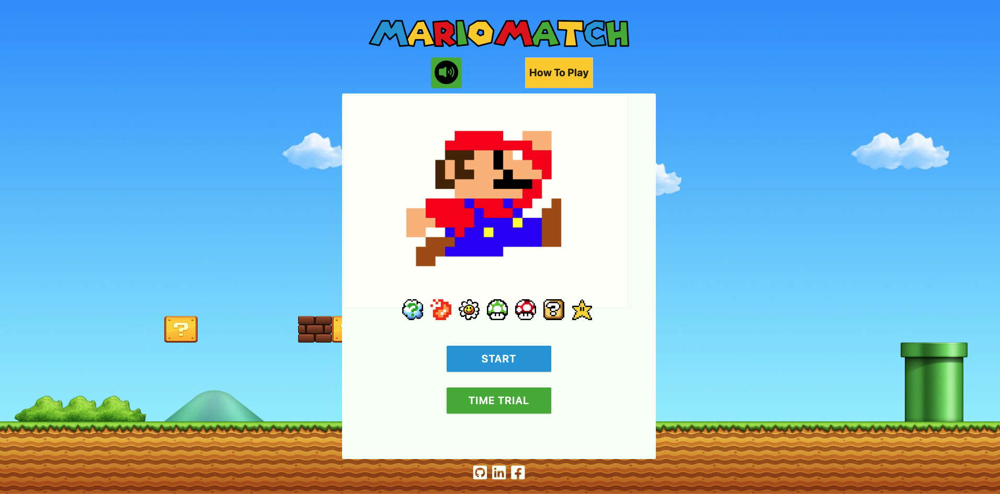
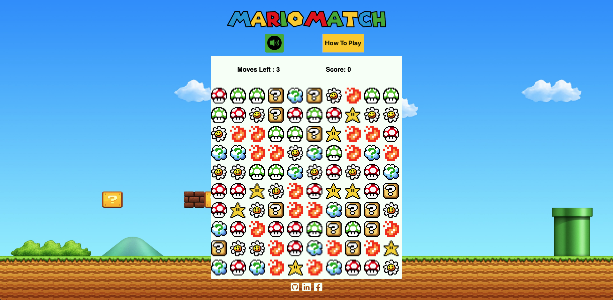
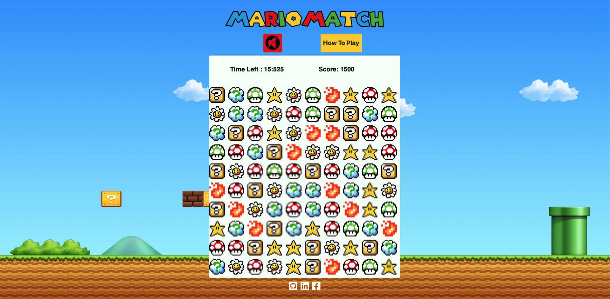

# Mario Match

Mario Match is a Bejeweled inspired game. Play it [here](https://kevinphanle.github.io/MarioMatch/).

## Technologies

* Javascript
* HTML5 Canvas

## Controls

Users can move gems to try to match 3 in a row in order to gain points while more gems fall onto the board.
Users click and swipe in order to swap tiles, similar to a touchscreen.
There is a button near the top which will open a modal with instructions when clicked. 

## Playing the Game

Upon loading the game, the user will see the following start screen with two options.

The user can then choose a regular game, where the motive is to earn as much points as possible within a limited number of moves, or a timed trial, where the user has unlimited moves but is within a time constraint instead.

Background music will begin playing, but the user has the option to mute it by clicking the mute button near the top.

Upon finishing one of the games, the user will be presented a game over screen where their final score is displayed.

## Future Features

* Limit moves to deny invalid moves
* Timer bar
* Score multipliers
* Bomb gems
* Streaks
* Levels
* Item usage
* Scoreboard
